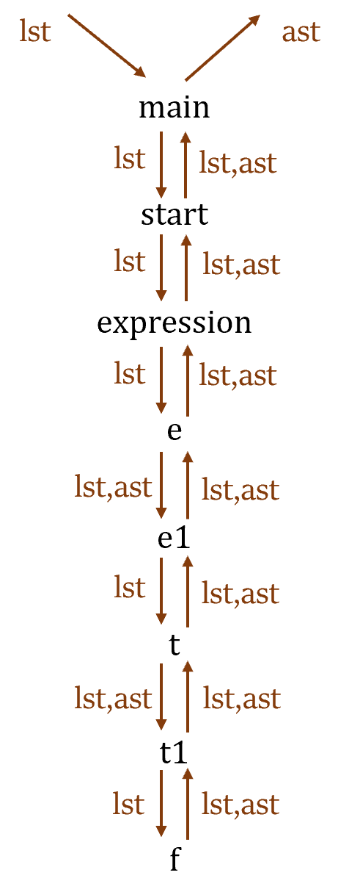

# Calculator 实验总结


## 设计方案

- 词法分析器+语法分析器：前者由于手搓工程量过大，一律采用$ocamllex$工具，后者的实现方式有二：

  - 自顶向下方法（Top-down，也称为Descent Recursive method）：一般用于手搓，需要避免左递归；
  - 自下而上方法（Bottom-up）：一般用于$ocamlyacc$，可以无需考虑左递归。

- 语法分析器先生成AST树（同时记录变量类型），再进而遍历求取运算结果。

- 工程设计上，采用$dune$工具分类整理源码。

- 功能实现：

  ```
  abc = 1; d = 3; abc + d; d * d;       # 先列出AST，再计算最终的数值；
  a = 3; b = 1; a + c;                  # 先列出AST，再报错“undefined Identifier”
  a = ;                                 # Syntax error报错
  ```

  

## 自顶向下方法

### 文件结构设计

```
Parser_calculator_descent_recursive/
├── src/                # 相当于程序的库
│   ├── ast.ml          # 目标语言字符，type term
│   ├── lexer.ml        # ocamllex自动生成
│   ├── lexer.mll       # 手写的词法分析器
│   ├── token.ml        # 初始语言字符，type token
│   ├── parser.ml       # 手写的语法分析器
│   ├── stack.ml        # 设定的module，用于存储类型和值的键值对
│   ├── print.ml        # 用于调试，递归函数更有效的方式
│   └── dune            
├── bin/                # 相当于可执行文件
│   ├── main.ml         # 主函数，其中let ()是程序入口
│   └── dune            
├── _build/             # 可执行文件目录
└── dune-project        # 记录项目的版本等信息
```

- 关于如何跨文件调用函数：
  - 在$dune$中进行相应的声明，才能调用。
  - 如果在文件中加入`open xxx`，如`open Parser`，则代表将相应文件展开，可以不用写`Parser.main_state`。

- 特别说明：$ast.ml$代表程序输出格式，$token.ml$代表程序输入格式，在自下而上的方法中，$token.ml$被包含进$parser.mly$中，不需要单独设立文件。

### dune的书写

1. $dune-project$

   ```
   (lang dune 3.0)
   ```

2. $./src/dune$

   ```
   (library
    (name my_library)
    (wrapped false)        # 代表可以直接展开，不需要写成My_library.Parser
    (modules token ast lexer parser stack print))
   ```

3. $./bin/dune$

   ```
   (executable
    (name main)
    (libraries my_library))
   ```

### 完整流程分析

- 首先，因为利用的是$OCamllex$的工具，但是没有利用$OCamlyacc$工具，不能简单的将前者结果赋值给后者，因此一个自然的想法是，将等$OCamllex$生成的数据流转化为一个$list$，进而被手写的$Parser$处理。

- 实现上，不支持$Ctrl+d$生成$EOF$符号。

- 设计文法如下，按照这个完成Parser的编写：

  ```
  main -> start EOF
  start -> expression ; start |  epsilon
  expression -> id = num | e
  e -> t e1
  e1 -> + t e1 | epsilon
  t -> f t1
  t1 -> * f t1 | epsilon
  f -> id | (e)
  ```

  - 在实现文法的同时，需要登记赋值语句（即变量类型表），这里采用module的结构，因为用class需要传递实体，非常麻烦。

- 遍历AST树，并进行变量定义检查及计算。

### Parser接口设计




## 自下而上方法

### 文件结构设计

```
Parser_calculator_yacc/
├── lib/                # 程序的库
│   ├── ast.ml          # 目标语言字符，type term
│   ├── lexer.ml        # ocamllex自动生成
│   ├── lexer.mll       # 手写的词法分析器
│   ├── parser.ml       # 自动生成的语法分析器
│   ├── parser.mli      # 语法分析器的接口
│   ├── parser.mly      # 手写的语法分析器
│   ├── stack.ml        # 设定的module，用于存储类型和值的键值对
│   └── dune            
├── main.ml             # 主函数，其中let ()是程序入口
├── _build/             # 可执行文件目录
├── dune                
└── dune-project        # 记录项目的版本等信息
```

- 和前者的区别在于后者的$Parser$采用$OCamlyacc$自动生成。

### 完整流程分析

- $lexer.mll$和$parser.mly$的调用关系有点混乱，在$parser.mly$中定义了$token$的列表，因此在前者的代码中需要调用$Parser$。

- 在编写$parser.mly$的时候，需要在文法中实现两个附带的功能：

  - 压栈，存放变量声明表；
  - 像`whole`这样不确定位数的语句，需要用专门的函数进行处理（可以存放在开始的%{%}区域内，也可以`let ... in ...`的语法。

- 二者的联合使用方法：

  ```ocaml
  let () =
    let lexbuf = Lexing.from_channel stdin in
    let ast = Parser.main Lexer.main lexbuf in
    let retstr = print_ast ast in
    Printf.printf "\n%s\n" retstr;
    calculate_print ast
  ;;
  ```


## 两种方法的比较

- 相对来说，手搓$Parser$的方式更为灵活，尤其是对报错等功能上；而利用`yacc`工具，从整体编程时间上更具有优势，也不用费力实现$lexbuf$到$list$的转换。


