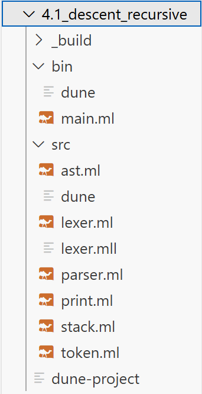
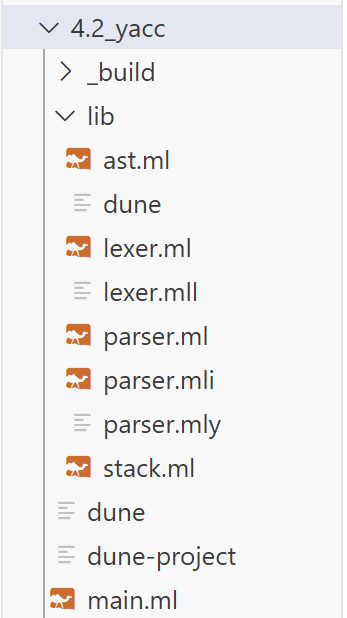
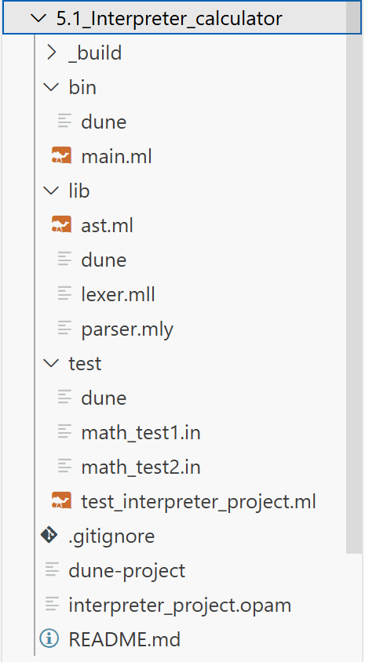
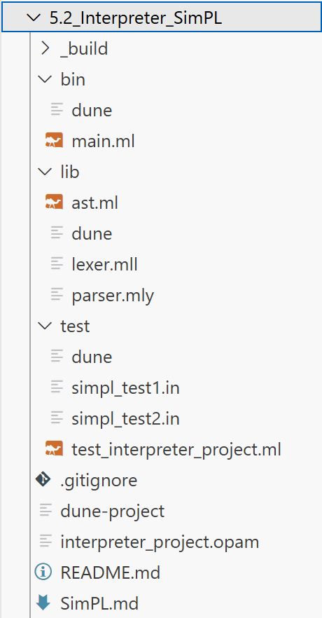
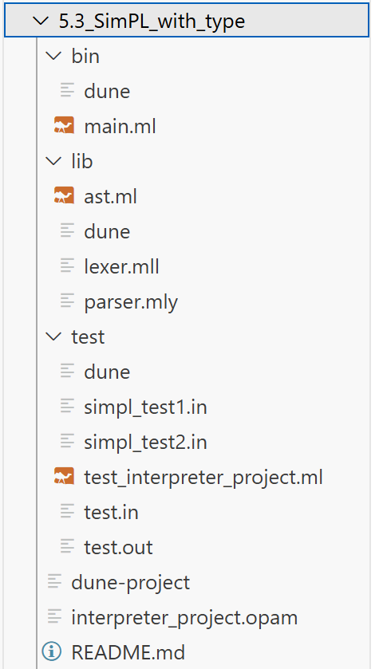
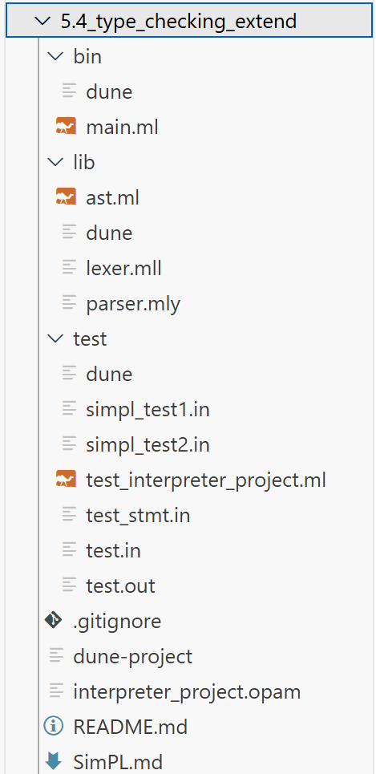

# 《程序语言理论与编译技术》机考代码备考

2023302121009 刘鼎琨


## Tutorial 1: Basic Programming Tasks of OCaml

### fib

```ocaml
let fib (num : int) =
  let rec fib_inner num x1 x2 =
    if num > 0
    then fib_inner (num - 1) x2 (x1 + x2)
    else if num < 0
    then failwith "wrong para"
    else x1
  in
  fib_inner num 0 1
;;
print_int (fib 19)
```

### times

```ocaml
let prod (lst : int list) =
  let rec prod_inner lst result =
    match lst with
    | x :: y -> prod_inner y (result * x)
    | _ -> result
  in
  prod_inner lst 1
;;
print_int (prod [ 1; 2; 3; 4; 5 ])
```

### compose

```ocaml
let compose (f1 : 'b -> 'c) (f2 : 'a -> 'b) a = f1 (f2 a)
let double x = x * 2
let add x = x + 1
let f = compose double add;;

print_int (f 3)
```

### forall

```ocaml
let rec forall (p : 'a -> bool) (lst : 'a list) =
  match lst with
  | x :: y -> if p x = true then forall p y else false
  | _ -> true
;;

let is_positive (num : int) = num > 0

let () =
  if forall is_positive [ 1; 3; 5; 7; -1 ]
  then print_endline "all true"
  else print_endline "not all true"
;;
```


## Tutorial 2: Advanced programming tasks of OCaml

### recursive form

```ocaml
(* max in a list *)

let rec max_1 (lst : int list) =
  match lst with
  | [] -> failwith "wrong"
  | [ x ] -> x
  | x :: y -> max x (max_1 y)
;;

let max_2 (lst : int list) =
  match lst with
  | [] -> failwith "wrong"
  | x :: y ->
    let rec max_inner lst (num : int) =
      match lst with
      | x :: y -> if x > num then max_inner y x else max_inner y num
      | _ -> num
    in
    max_inner lst x
;;

print_int (max_1 [ 1; 3; 2; 4; 0 ]);;
print_newline ();;
print_int (max_2 [ 2; 4; 9; 1; 4; 5 ])
```

### list functions

```ocaml
let double_num (x : int) = x * 2
let new_one = List.map double_num [ 111; 222; 333 ]

let f (num : int) =
  print_int num;
  print_char ' '
;;

List.iter f new_one;;
print_newline ()

let new_one_2 = List.filter (fun (x : int) -> x > 400) new_one;;

List.iter f new_one_2;;
print_newline ();;
List.iter f (List.rev new_one_2);;
print_newline ()

let x = List.sort compare [ 1; 3; 2; 5; 4; 7 ]
let y = List.sort (Fun.flip compare) [ 1; 3; 2; 5; 4; 7 ];;

List.iter f x;;
print_newline ();;
List.iter f y;;
print_newline ();;
print_int (List.fold_left ( + ) 0 [ 1; 3; 4; 5; 2 ]);;
print_newline ()

type correct =
  | MYTrue
  | MYFalse

let func (a : int) (b : correct) = if b = MYTrue then a + 1 else a;;

print_int (List.fold_left func 0 [ MYTrue; MYFalse; MYTrue; MYFalse; MYTrue ]);;
print_newline ()
```

### diff sequence

```ocaml
let diff (x : int list) =
  let rec diff_inner x lst =
    match x with
    | x :: y :: t -> diff_inner ([ y ] @ t) (List.append lst [ y - x ])
    | _ -> lst
  in
  diff_inner x []
;;

let lst = diff [ 1; 2; -1; 4; 2 ]
let f x = print_endline (string_of_int x);;

List.iter f lst
```

### small buf

```ocaml
let string_to_char_list str = String.fold_right (fun c acc -> c :: acc) str []

let rec rotate_left lst n =
  if n <= 0
  then lst
  else (
    match lst with
    | [] -> []
    | hd :: tl -> rotate_left (tl @ [ hd ]) (n - 1))
;;

let rotate_right lst n =
  let len = List.length lst in
  let n = n mod len in
  rotate_left lst (len - n)
;;

let rec smallbf_helper mem cmd offset =
  match mem with
  | [] -> failwith "wrong"
  | curr_mem :: rest_mem ->
    (match cmd with
     | [] -> rotate_right (curr_mem :: rest_mem) offset
     | '+' :: rest -> smallbf_helper ((curr_mem + 1) :: rest_mem) rest offset
     | '>' :: rest -> smallbf_helper (rest_mem @ [ curr_mem ]) rest (offset + 1)
     | _ -> failwith "wrong")
;;

let smallbf mem cmd_as_str = smallbf_helper mem (string_to_char_list cmd_as_str) 0
let x = smallbf [ 2; 0; 1 ] "++>>+>++"

let f num =
  print_int num;
  print_newline ()
;;

List.iter f x
```


## Tutorial 3: Object-oriented programming in OCaml

### module

```ocaml
(* Usage1 : as global variables *)
module type Example_1 = sig
  val lst : int list ref
  val append_lst : int -> unit
  val getlst : unit -> int list
end

module Example_1 : Example_1 = struct
  let lst = ref [ 1; 2; 3 ]
  let append_lst num = lst := !lst @ [ num ]
  let getlst () = !lst
end

let f num = print_endline (string_of_int num);;

Example_1.append_lst 4;;
List.iter f (Example_1.getlst ())

(* Usage2 : as a function set *)
module type Example_2 = sig
  type person =
    { name : string
    ; mutable score : int
    }

  val double_score : person -> person
end

module Example_2 : Example_2 = struct
  type person =
    { name : string
    ; mutable score : int
    }

  let double_score p =
    p.score <- p.score * 2;
    p
  ;;
end

open Example_2

let ex = { name = "happy"; score = 100 };;

Example_2.double_score ex
```

### class

```ocaml
class type people_inter = object
  val name : string
  val mutable age : int
  method change_age : int -> unit
  method print_info : unit -> unit
end

class people (name : string) (age : int) : people_inter =
  object
    val name = name
    val mutable age = age
    method change_age num = age <- num

    method print_info () =
      print_endline ("name:" ^ name ^ "; age:" ^ string_of_int age ^ ";")
  end

class student (name : string) (age : int) (score : int) =
  object
    inherit people name age as super
    val mutable score = score
    method change_score num = score <- num
  end

let example = new student "allen" 20 100;;

example#change_age 21;;
example#print_info ()
```

### functor

```ocaml
module type Person = sig
  val life : int ref
  val change_life : int -> unit
end

module Fight (P1 : Person) (P2 : Person) = struct
  let winner () =
    if P1.life > P2.life then print_endline "p1 wins" else print_endline "p2 wins"
  ;;
end

module A : Person = struct
  let life = ref 10
  let change_life num = life := num
end

module B : Person = struct
  let life = ref 10
  let change_life num = life := num
end
;;

B.change_life 20

module Result = Fight (A) (B);;

Result.winner ()
```


## Tutorial 4: Lexer and Parser

### recursive descent



#### dune1

```dune
(executable
 (name main)
 (libraries my_library))
```

#### main

```ocaml
open Ast
open Print

let rec calculate_num ast =
  match ast with
  | Add (x, y) -> calculate_num x + calculate_num y
  | Sub (x, y) -> calculate_num x - calculate_num y
  | Mul (x, y) -> calculate_num x * calculate_num y
  | Div (x, y) -> calculate_num x / calculate_num y
  | Id x -> Stack.check x
  | _ -> raise (Failure "error in calculate_num")
;;

let calculate_print ast =
  match ast with
  | Whole lst ->
    let rec func list =
      match list with
      | [] -> ()
      | h :: t ->
        (match h with
         | Assign _ -> func t
         | _ ->
           Printf.printf "\nRESULT: %d\n" (calculate_num h);
           func t)
    in
    func lst
  | _ -> raise (Failure "error calculate_print")
;;

let () =
  let lexbuf = Lexing.from_channel stdin in
  let tokens = Lexer.gettokens [] lexbuf in
  (* (match List.rev tokens with
   | h :: _ -> print_string (Parser.string_of_token h)
   | _ -> print_string "NO");  *)
  let ast = Parser.main_state tokens in
  let retstr = print_ast ast in
  Printf.printf "\n%s\n" retstr;
  calculate_print ast
;;
```

#### ast

```ocaml
type term =
  | Add of term * term
  | Sub of term * term
  | Mul of term * term
  | Div of term * term
  | Assign of term * term
  | Num of int
  | Id of string
  | Whole of term list
  | Null
```

#### dune2

```dune
(library
 (name my_library)
 (wrapped false)
 (modules token ast lexer parser stack print))
```

#### lexer

```ocaml
{
    open Token

}

rule main = parse
| ['a'-'z']+ as str { ID (str) }
| ['0'-'9']+ as num { NUM (int_of_string num) }
| [' ' '\n' '\t'] { main lexbuf }
| "+" { ADD }
| "-" { SUB }
| "*" { MUL }
| "/" { DIV }
| "(" { LEFT }
| ")" { RIGHT }
| "=" { ASSIGN }
| ";" { SEG }
| eof { EOF }
| _ { failwith "error in lexing" }


{

(* let string_of_token2 tok =
  match tok with
  | EOF -> "eof"
  | ID _ -> "id"
  | NUM _ -> "num"
  | ADD -> "add"
  | SUB -> "sub"
  | MUL -> "mul"
  | DIV -> "div"
  | LEFT -> "left"
  | RIGHT -> "right"
  | SEG -> "seg"
  | ASSIGN -> "assign"
;;  *)

let rec gettokens (lst : token list) lexbuf =
    let token = main lexbuf in
    match token with
    | EOF -> (* Printf.printf "%s\n" (string_of_token2 token);*) lst @ [EOF] 
    | _ -> (* Printf.printf "%s\n" (string_of_token2 token);*) gettokens (lst @ [token]) lexbuf 
;;
 
}
```

#### parser

```ocaml
open Ast
open Token

(*let string_of_token tok =
  match tok with
  | EOF -> "eof"
  | ID _ -> "id"
  | NUM _ -> "num"
  | ADD -> "add"
  | SUB -> "sub"
  | MUL -> "mul"
  | DIV -> "div"
  | LEFT -> "left"
  | RIGHT -> "right"
  | SEG -> "seg"
  | ASSIGN -> "assign"
;;  *)

let rec start_state lst ast =
  match lst with
  | ID _ :: _ | LEFT :: _ ->
    (* print_string "here1!"; *)
    let lst, ast = expression_state lst in
    (match lst with
     | SEG :: t ->
       (* print_string "here2!"; *)
       let lsti, asti = start_state t ast in
       (match asti with
        | Whole x -> lsti, Whole (ast :: x)
        | x -> lsti, Whole [ x ])
     | _ -> raise (Failure "error start_state!"))
  | EOF :: _ -> lst, ast
  | _ -> raise (Failure "error start_state!")

and expression_state lst =
  match lst with
  | ID x :: y ->
    (match y with
     | ASSIGN :: rs ->
       (match rs with
        | NUM num :: rest_list ->
          Stack.push (x, num);
          rest_list, Assign (Id x, Num num)
        | _ -> raise (Failure "error expression_state1!"))
     | MUL :: _ | DIV :: _ | ADD :: _ | SUB :: _ | SEG :: _ | RIGHT :: _ -> e_state lst
     | EOF :: _ -> raise (Failure "error expression_state4!")
     | _ ->
       (* print_string (string_of_token h); *)
       raise (Failure "error expression_state2!"))
  | LEFT :: _ -> e_state lst
  | _ -> raise (Failure "error expression_state3!")

and e_state lst =
  match lst with
  | ID _ :: _ | LEFT :: _ ->
    let retlst, ast = t_state lst in
    e1_state retlst ast
  | _ -> raise (Failure "error e_state!")

and e1_state lst ast =
  match lst with
  | ADD :: t ->
    let retlst1, ast1 = t_state t in
    e1_state retlst1 (Add (ast, ast1))
  | SUB :: t ->
    let retlst1, ast1 = t_state t in
    e1_state retlst1 (Sub (ast, ast1))
  | RIGHT :: _ | SEG :: _ | EOF :: _ -> lst, ast
  | _ -> raise (Failure "error e1_state!")

and t_state lst =
  match lst with
  | ID _ :: _ | LEFT :: _ ->
    let retlst1, ast1 = f_state lst in
    t1_state retlst1 ast1
  | _ -> raise (Failure "error t_state!")

and t1_state lst ast =
  match lst with
  | MUL :: t ->
    let retlst1, ast1 = f_state t in
    t1_state retlst1 (Mul (ast, ast1))
  | DIV :: t ->
    let retlst1, ast1 = f_state t in
    t1_state retlst1 (Div (ast, ast1))
  | RIGHT :: _ | SEG :: _ | EOF :: _ | ADD :: _ | SUB :: _ -> lst, ast
  | _ -> raise (Failure "error t1_state!")

and f_state lst =
  match lst with
  | ID x :: t -> t, Id x
  | LEFT :: t ->
    let retlst, ast1 = e_state t in
    (match retlst with
     | RIGHT :: t -> t, ast1
     | _ -> raise (Failure "error f_state!"))
  | _ -> raise (Failure "error f_state!")
;;

let main_state lst =
  match lst with
  | ID _ :: _ | EOF :: _ | LEFT :: _ ->
    let lst, ast = start_state lst Null in
    (match lst with
     | EOF :: _ -> ast
     | _ -> raise (Failure "error main_state!"))
  | _ -> raise (Failure "error main_state!")
;;
```

#### print

```ocaml
open Ast

let rec print_ast ast =
  match ast with
  | Add (x, y) -> Printf.sprintf "(add %s %s)" (print_ast x) (print_ast y)
  | Sub (x, y) -> Printf.sprintf "(sub %s %s)" (print_ast x) (print_ast y)
  | Mul (x, y) -> Printf.sprintf "(mul %s %s)" (print_ast x) (print_ast y)
  | Div (x, y) -> Printf.sprintf "(div %s %s)" (print_ast x) (print_ast y)
  | Assign (x, y) -> Printf.sprintf "(assign %s %s)" (print_ast x) (print_ast y)
  | Num x -> Printf.sprintf "%s" (string_of_int x)
  | Id x -> Printf.sprintf "(Id %s)" x
  | Whole x ->
    let rec print_list lst =
      match lst with
      | [] -> ""
      | h :: t -> Printf.sprintf "%s %s" (print_ast h) (print_list t)
    in
    Printf.sprintf "whole %s" (print_list x)
  | Null -> Printf.sprintf "null"
;;
```

#### stack

```ocaml
let stack : (string * int) list ref = ref []
let push x = stack := x :: !stack

let check (input : string) =
  let rec checkinner (input : string) lst =
    match lst with
    | [] -> failwith "undefined identifier!"
    | x :: xs -> if fst x = input then snd x else checkinner input xs
  in
  checkinner input !stack
;;
```

#### token

```ocaml
type token =
  | EOF
  | ID of string
  | NUM of int
  | ADD
  | SUB
  | MUL
  | DIV
  | LEFT
  | RIGHT
  | SEG
  | ASSIGN
```

#### dune_project

```dune
(lang dune 3.0)
```


### yacc



#### ast

```ocaml
type term =
  | Add of term * term
  | Sub of term * term
  | Mul of term * term
  | Div of term * term
  | Assign of term * term
  | Num of int
  | Id of string
  | Whole of term list
  | Null
```

#### dune

```dune
(library
 (name my_lib)
 (modules ast parser lexer stack))
```

#### lexer

```ocaml
{
    open Parser
}

rule main = parse
| ['a'-'z']+ as str { ID (str) }
| ['0'-'9']+ as num { NUM (int_of_string num) }
| [' ' '\n' '\t'] { main lexbuf }
| "+" { ADD }
| "-" { SUB }
| "*" { MUL }
| "/" { DIV }
| "(" { LEFT }
| ")" { RIGHT }
| "=" { ASSIGN }
| ";" { SEG }
| eof { EOF }
| _ { failwith "error in lexing" }
```

#### parser

```ocaml
%{
    open Ast;;
    
    let conbine x y =
        match x with 
        | Whole (a) -> Whole (a @ [y])
        | Null -> Whole ([y])
        | _ -> raise (Failure "error start!");;
%}

%token EOF ADD SUB MUL DIV LEFT RIGHT SEG ASSIGN 
%token <int> NUM
%token <string> ID
%start main
%type <Ast.term> main

%left ADD SUB
%left MUL DIV

%%
main:
    start EOF { $1 }
;

start:
    | start expression SEG { 
        conbine $1 $2 }
    | expression SEG { Whole ([$1]) }
    | /* empty */ { Null }
;

expression:
    | ID ASSIGN NUM { 
        Stack.push ($1, $3);
        Assign (Id($1), Num($3)) } 
    | e { $1 }
;

e:
    | e ADD t { Add($1, $3) }
    | e SUB t { Sub($1, $3) }
    | t { $1 }
;

t:
    | t MUL f { Mul($1, $3) }
    | t DIV f { Div($1, $3) }
    | f { $1 }
;

f: 
    | ID { Id($1) } 
    | LEFT e RIGHT { $2 }
;
```

#### stack

```ocaml
let stack : (string * int) list ref = ref []
let push x = stack := x :: !stack

let check (input : string) =
  let rec checkinner (input : string) lst =
    match lst with
    | [] -> failwith "undefined identifier!"
    | x :: xs -> if fst x = input then snd x else checkinner input xs
  in
  checkinner input !stack
;;
```

#### dune

```dune
(executable
 (name main)
 (libraries my_lib))
```

#### dune project

```dune
(lang dune 3.0)
```

#### main

```ocaml
open My_lib
open Ast

let rec print_ast ast =
  match ast with
  | Add (x, y) -> Printf.sprintf "(add %s %s)" (print_ast x) (print_ast y)
  | Sub (x, y) -> Printf.sprintf "(sub %s %s)" (print_ast x) (print_ast y)
  | Mul (x, y) -> Printf.sprintf "(mul %s %s)" (print_ast x) (print_ast y)
  | Div (x, y) -> Printf.sprintf "(div %s %s)" (print_ast x) (print_ast y)
  | Assign (x, y) -> Printf.sprintf "(assign %s %s)" (print_ast x) (print_ast y)
  | Num x -> Printf.sprintf "%s" (string_of_int x)
  | Id x -> Printf.sprintf "(Id %s)" x
  | Whole x ->
    let rec print_list lst =
      match lst with
      | [] -> ""
      | h :: t -> Printf.sprintf "%s %s" (print_ast h) (print_list t)
    in
    Printf.sprintf "whole %s" (print_list x)
  | Null -> Printf.sprintf "null"
;;

let rec calculate_num ast =
  match ast with
  | Add (x, y) -> calculate_num x + calculate_num y
  | Sub (x, y) -> calculate_num x - calculate_num y
  | Mul (x, y) -> calculate_num x * calculate_num y
  | Div (x, y) -> calculate_num x / calculate_num y
  | Id x -> Stack.check x
  | _ -> raise (Failure "error in calculate_num")
;;

let calculate_print ast =
  match ast with
  | Whole lst ->
    let rec func list =
      match list with
      | [] -> ()
      | h :: t ->
        (match h with
         | Assign _ -> func t
         | _ ->
           Printf.printf "\nRESULT: %d\n" (calculate_num h);
           func t)
    in
    func lst
  | _ -> raise (Failure "error calculate_print")
;;

let () =
  let lexbuf = Lexing.from_channel stdin in
  let ast = Parser.main Lexer.main lexbuf in
  let retstr = print_ast ast in
  Printf.printf "\n%s\n" retstr;
  calculate_print ast
;;
```


## Tutorial 5: Interpreter

### calculator



#### dune1

```dune
(executable
 (public_name interpreter_project)
 (name main)
 (modules main)
 (libraries mathlib)
 (flags (:standard -w -32-27-26-39)))
```

#### main

```ocaml
open Mathlib
open Ast

let rec string_of_expr (e : expr) : string = 
  match e with
  | Int n -> Printf.sprintf "Int %d" n
  | Binop (binop, e1, e2) ->
    let binop_str = 
      match binop with 
      | Add -> "Add"
      | Mul -> "Mul"
      | Sub -> "Sub"
      | Div -> "Div"
    in
    Printf.sprintf "Binop (%s, %s, %s)" binop_str (string_of_expr e1) (string_of_expr e2)


let parse s : expr =
  let lexbuf = Lexing.from_string s in
  let ast = Parser.main Lexer.read lexbuf in
  ast


(* check if an expression is a value (i.e., fully evaluated) *)
let is_value : expr -> bool = function
  | Int _ -> true
  | Binop _ -> false


(* takes a single step of evaluation of [e] *)
let rec step : expr -> expr = function
  | Int _ -> failwith "Does not step on a number"

  (* No need for further stepping if both sides are already values *)
  | Binop (binop, e1, e2) when is_value e1 && is_value e2 -> 
    step_binop binop e1 e2

  (* Evaluate the right side of the binop if the left side is a value *)
  | Binop (binop, e1, e2) when is_value e1 -> Binop (binop, e1, step e2)

  (* Leftmost step for binop *)
  | Binop (binop, e1, e2) -> Binop (binop, step e1, e2)


(* implement the primitive operation [v1 binop v2].
   Requires: [v1] and [v2] are both values. *)
and step_binop binop v1 v2 = match binop, v1, v2 with
  | Add, Int a, Int b -> Int (a + b)
  | Sub, Int a, Int b -> Int (a - b)
  | Mul, Int a, Int b -> Int (a * b)
  | Div, Int a, Int b when b <> 0 -> Int (a / b)
  | Div, Int _, Int 0 -> failwith "Division by zero"
  | _ -> failwith "Operator and operand type mismatch"


(* fully evaluate [e] to a value [v] *)
let rec eval (e : expr) : expr =
  if is_value e then e else
    e |> step |> eval


(* interpret [s] by lexing -> parsing -> evaluating and converting the result to a string *)
let interp (s : string) : string = 
  s |> parse |> eval |> string_of_expr


let rec eval_big (e : expr) : expr = match e with
  | Int _ -> e
  | Binop (binop, e1, e2) -> eval_bop binop e1 e2

and eval_bop binop e1 e2 = match binop, eval_big e1, eval_big e2 with
  | Add, Int a, Int b -> Int (a + b)
  | Sub, Int a, Int b -> Int (a - b)
  | Mul, Int a, Int b -> Int (a * b)
  | Div, Int a, Int b when b <> 0 -> Int (a / b)
  | Div, Int _, Int 0 -> failwith "Division by zero"
  | _ -> failwith "Operator and operand type mismatch"

let interp_big (s : string) : string = 
  s |> parse |> eval_big |> string_of_expr
  
let () =
  let filename = "test/math_test2.in" in
  let in_channel = open_in filename in
  let file_content = really_input_string in_channel (in_channel_length in_channel) in
  close_in in_channel;

  let res = interp file_content in
  Printf.printf "Result of interpreting %s:\n%s\n\n" filename res;

  let res = interp_big file_content in
  Printf.printf "Result of interpreting %s with big-step model:\n%s\n\n" filename res;

  let ast = parse file_content in 
  Printf.printf "AST: %s\n" (string_of_expr ast);
```

#### ast

```ocaml
type binop = 
  | Add
  | Sub
  | Mul
  | Div

type expr =
  | Int of int
  | Binop of binop * expr * expr
```

#### dune2

```dune
(library
 (name mathlib)
 (modules parser lexer ast))

(ocamllex lexer)
(ocamlyacc parser)
```

#### lexer

```ocaml
{
    open Parser
}

(* 规则定义 *)
rule read = parse 
    | [' ' '\t' '\n'] { read lexbuf }
    | ['0'-'9']+ as num { INT (int_of_string num) }
    | '+' { PLUS }
    | '-' { MINUS }
    | '*' { TIMES }
    | '/' { DIV }
    | '(' { LPAREN }
    | ')' { RPAREN }
    | eof { EOF }
    | _ { failwith "Invalid character" }
```

#### parser

```ocaml
%{
    open Ast
%}

%token <int> INT
%token PLUS MINUS TIMES DIV EOF
%token LPAREN RPAREN


%left PLUS MINUS
%left TIMES DIV

%start main
%type <Ast.expr> main
%%

main:
    expr EOF { $1 }
;

expr:
    | INT { Int $1 }
    | expr TIMES expr { Binop (Mul, $1, $3) }
    | expr DIV expr   { Binop (Div, $1, $3) }
    | expr PLUS expr  { Binop (Add, $1, $3) }
    | expr MINUS expr { Binop (Sub, $1, $3) }
    | LPAREN expr RPAREN { $2 }
;
```

#### dune2

```dune
(test
 (name test_interpreter_project))
```

#### math_test1

```
2*2*10+5*5-7/3
```

#### math_test2

```
5*(4+3)+7*(3+4)-7/2
```

#### dune project

```dune
(lang dune 3.17)

(name interpreter_project)

(generate_opam_files true)

(source
 (github AugustineYang/OCaml-Interpreter))

(authors "Yang Yuanzhao <yang_yuanzhao@whu.edu.cn>")

(license LICENSE)

(package
 (name interpreter_project)
 (synopsis "A short synopsis")
 (description "A longer description")
 (depends ocaml)
 (tags
  ("add topics" "to describe" your project)))
```


### SimPL



#### dune1

```dune
(executable
 (public_name interpreter_project)
 (name main)
 (modules main)
 (libraries interpreterlib)
 (flags (:standard -w -32-27-26-39-8)))
```

#### main

```ocaml
open Interpreterlib
open Ast

let rec string_of_expr (e : expr) : string =
  match e with
  | Int n -> Printf.sprintf "Int %d" n
  | Var id -> Printf.sprintf "Var %s" id
  | Bool b ->
    let b_str =
      match b with
      | true -> "true"
      | false -> "false"
    in
    Printf.sprintf "Bool %s" b_str
  | Binop (binop, e1, e2) ->
    let binop_str =
      match binop with
      | Add -> "Add"
      | Mul -> "Mul"
      | Sub -> "Sub"
      | Div -> "Div"
      | Leq -> "Leq"
    in
    Printf.sprintf "Binop (%s, %s, %s)" binop_str (string_of_expr e1) (string_of_expr e2)
  | Let (var, e1, e2) ->
    Printf.sprintf "Let (%s, %s, %s)" var (string_of_expr e1) (string_of_expr e2)
  | If (e1, e2, e3) ->
    Printf.sprintf
      "If (%s, %s, %s)"
      (string_of_expr e1)
      (string_of_expr e2)
      (string_of_expr e3)
;;

let parse s : expr =
  let lexbuf = Lexing.from_string s in
  let ast = Parser.main Lexer.read lexbuf in
  ast
;;

(* check if an expression is a value (i.e., fully evaluated) *)
let is_value : expr -> bool = function
  | Int _ | Bool _ -> true
  | Var _ | Binop _ | If _ | Let _ -> false
;;

(** [subst e v x] is [e] with [v] substituted for [x], that
    is, [e{v/x}]. *)
let rec subst e v x =
  match e with
  | Var y -> if x = y then v else e
  | Bool _ -> e
  | Int _ -> e
  | Binop (binop, e1, e2) -> Binop (binop, subst e1 v x, subst e2 v x)
  | If (e1, e2, e3) -> If (subst e1 v x, subst e2 v x, subst e3 v x)
  | Let (y, e1, e2) ->
    let e1' = subst e1 v x in
    if x = y then Let (y, e1', e2) else Let (y, e1', subst e2 v x)
;;

(* takes a single step of evaluation of [e] *)
let rec step : expr -> expr = function
  | Int _ | Bool _ -> failwith "Does not step on a number"
  | Var _ -> failwith "Unbound variable"
  (* No need for further stepping if both sides are already values *)
  | Binop (binop, e1, e2) when is_value e1 && is_value e2 -> step_binop binop e1 e2
  (* Evaluate the right side of the binop if the left side is a value *)
  | Binop (binop, e1, e2) when is_value e1 -> Binop (binop, e1, step e2)
  (* Leftmost step for binop *)
  | Binop (binop, e1, e2) -> Binop (binop, step e1, e2)
  | If (Bool true, e2, _) -> e2
  | If (Bool false, _, e3) -> e3
  | If (Int _, _, _) -> failwith "Condition must be a boolean"
  | If (e1, e2, e3) -> If (step e1, e2, e3)
  | Let (x, e1, e2) when is_value e1 -> subst e2 e1 x
  | Let (x, e1, e2) -> Let (x, step e1, e2)

(* implement the primitive operation [v1 binop v2].
   Requires: [v1] and [v2] are both values. *)
and step_binop binop v1 v2 =
  match binop, v1, v2 with
  | Add, Int a, Int b -> Int (a + b)
  | Sub, Int a, Int b -> Int (a - b)
  | Mul, Int a, Int b -> Int (a * b)
  | Div, Int a, Int b when b <> 0 -> Int (a / b)
  | Div, Int _, Int 0 -> failwith "Division by zero"
  | Leq, Int a, Int b -> Bool (a <= b)
  | _ -> failwith "Operator and operand type mismatch"
;;

(* fully evaluate [e] to a value [v] *)
let rec eval (e : expr) : expr = if is_value e then e else e |> step |> eval

(* interpret [s] by lexing -> parsing -> evaluating and converting the result to a string *)
let interp (s : string) : string = s |> parse |> eval |> string_of_expr

let rec eval_big (e : expr) : expr =
  match e with
  | Int _ | Bool _ -> e
  | Var _ -> failwith "Unbound variable"
  | Binop (binop, e1, e2) -> eval_bop binop e1 e2
  | Let (x, e1, e2) -> subst e2 (eval_big e1) x |> eval_big
  | If (e1, e2, e3) -> eval_if e1 e2 e3

and eval_bop binop e1 e2 =
  match binop, eval_big e1, eval_big e2 with
  | Add, Int a, Int b -> Int (a + b)
  | Sub, Int a, Int b -> Int (a - b)
  | Mul, Int a, Int b -> Int (a * b)
  | Div, Int a, Int b when b <> 0 -> Int (a / b)
  | Div, Int _, Int 0 -> failwith "Division by zero"
  | Leq, Int a, Int b -> Bool (a <= b)
  | _ -> failwith "Operator and operand type mismatch"

and eval_if e1 e2 e3 =
  match eval_big e1 with
  | Bool true -> eval_big e2
  | Bool false -> eval_big e3
  | _ -> failwith "Condition must be a boolean"
;;

let interp_big (s : string) : string = s |> parse |> eval_big |> string_of_expr

let () =
  (*let filename = "test/simpl_test1.in" in*)
  let filename = "test/simpl_test2.in" in
  let in_channel = open_in filename in
  let file_content = really_input_string in_channel (in_channel_length in_channel) in
  close_in in_channel;
  let res = interp file_content in
  Printf.printf "Result of interpreting %s:\n%s\n\n" filename res;
  let res = interp_big file_content in
  Printf.printf "Result of interpreting %s with big-step model:\n%s\n\n" filename res;
  let ast = parse file_content in
  Printf.printf "AST: %s\n" (string_of_expr ast)
;;
```

#### ast 

```ocaml
type binop = 
  | Add
  | Sub
  | Mul
  | Div
  | Leq

type expr =
  | Int of int
  | Var of string
  | Bool of bool
  | Binop of binop * expr * expr
  | Let of string * expr * expr
  | If of expr * expr * expr
```

#### dune2

```dune
(library
 (name interpreterlib)
 (modules parser lexer ast))

(ocamllex lexer)
(ocamlyacc parser)
```

#### lexer

```ocaml
{
    open Parser
}

rule read = parse 
    | [' ' '\t' '\n'] { read lexbuf }
    | '+' { PLUS }
    | '-' { MINUS }
    | '*' { TIMES }
    | '/' { DIV }
    | '(' { LPAREN }
    | ')' { RPAREN }
    | "<=" { LEQ }
    | "true" { TRUE }
    | "false" { FALSE }
    | "let" { LET }
    | "=" { EQUALS }
    | "in" { IN }
    | "if" { IF }
    | "then" { THEN }
    | "else" { ELSE }
    | ['0'-'9']+ as num { INT (int_of_string num) }
    | ['a'-'z' 'A'-'Z']+ as id { ID id }
    | eof { EOF }
    | _ { failwith "Invalid character" }
```

#### parser

```ocaml
%{
    open Ast
%}

%token <int> INT
%token <string> ID
%token PLUS MINUS TIMES DIV EOF
%token LPAREN RPAREN
%token LEQ
%token TRUE FALSE
%token LET EQUALS IN
%token IF THEN ELSE 

%nonassoc IN
%nonassoc ELSE
%left LEQ
%left PLUS MINUS
%left TIMES DIV

%start main
%type <Ast.expr> main
%%

main:
    expr EOF { $1 }
;

expr:
    | INT { Int $1 }
    | ID { Var $1 }
    | TRUE { Bool true }
    | FALSE { Bool false}
    | expr LEQ expr   { Binop (Leq, $1, $3) }
    | expr TIMES expr { Binop (Mul, $1, $3) }
    | expr DIV expr   { Binop (Div, $1, $3) }
    | expr PLUS expr  { Binop (Add, $1, $3) }
    | expr MINUS expr { Binop (Sub, $1, $3) }
    | LET ID EQUALS expr IN expr  { Let ($2, $4, $6) }
    | IF expr THEN expr ELSE expr { If ($2, $4, $6) }
    | LPAREN expr RPAREN { $2 }
;
```

#### dune3

```dune
(test
 (name test_interpreter_project))
```

#### simpl_test1

```
let x = 3110 in x + x
```

#### simpl_test2

```
let y = 6 in let x = 5 * 6 in if x <= 30 - y then x - 1 else y + 1
```

#### dune project

```dune
(lang dune 3.17)

(name interpreter_project)

(generate_opam_files true)

(source
 (github AugustineYang/OCaml-Interpreter))

(authors "Yang Yuanzhao <yang_yuanzhao@whu.edu.cn>")

(license LICENSE)

(package
 (name interpreter_project)
 (synopsis "A short synopsis")
 (description "A longer description")
 (depends ocaml)
 (tags
  ("add topics" "to describe" your project)))
```


### SimPL with type checking



#### dune1

```dune
(executable
 (public_name interpreter_project)
 (name main)
 (modules main)
 (libraries interpreterlib)
 (flags (:standard -w -32-27-26-39-8)))
```

#### main

```ocaml
open Interpreterlib
open Ast

let rec string_of_expr (e : expr) : string = 
  match e with
  | Int n -> Printf.sprintf "Int %d" n
  | Bool b -> Printf.sprintf "Bool %b" b
  | Var x -> Printf.sprintf "Var %s" x
  | Binop (binop, e1, e2) ->
    let binop_str = 
      match binop with 
      | Add -> "Add"
      | Mul -> "Mul"
      | Sub -> "Sub"
      | Div -> "Div"
      | Leq -> "Leq"
    in
    Printf.sprintf "Binop (%s, %s, %s)" binop_str (string_of_expr e1) (string_of_expr e2)
  | Let (e1, e2, e3) -> Printf.sprintf "Let (%s, %s, %s)"  (e1) (string_of_expr e2) (string_of_expr e3)
  | If (e1, e2, e3) -> Printf.sprintf "If (%s, %s, %s)"  (string_of_expr e1) (string_of_expr e2) (string_of_expr e3)


let parse s : expr =
  let lexbuf = Lexing.from_string s in
  let ast = Parser.main Lexer.read lexbuf in
  ast


(* check if an expression is a value (i.e., fully evaluated) *)
let is_value : expr -> bool = function
  | Int _ -> true
  | Bool _ -> true
  | Var _ -> true
  | _ -> false


(* takes a single step of evaluation of [e] *)
let rec step : expr -> expr = function
  | Int _  | Bool _ | Var _ -> failwith "Does not step on a number"

  (* No need for further stepping if both sides are already values *)
  | Binop (binop, e1, e2) when is_value e1 && is_value e2 -> 
    step_binop binop e1 e2

  (* Evaluate the right side of the binop if the left side is a value *)
  | Binop (binop, e1, e2) when is_value e1 -> Binop (binop, e1, step e2)

  (* Leftmost step for binop *)
  | Binop (binop, e1, e2) -> Binop (binop, step e1, e2)

  | If (e1, e2, e3) -> begin
    (* 不用一口气全化简完 *)
      if is_value e1 then step_if e1 e2 e3
      else If((step e1), e2, e3)
    end
  | Let (x, e2, e3) -> begin
    (* 不用一口气全化简完 *)
    if is_value e2 then subst x e2 e3 
    else Let(x, step e2, e3)
  end


(* implement the primitive operation [v1 binop v2].
   Requires: [v1] and [v2] are both values. *)
and step_binop binop v1 v2 = match binop, v1, v2 with
  | Add, Int a, Int b -> Int (a + b)
  | Sub, Int a, Int b -> Int (a - b)
  | Mul, Int a, Int b -> Int (a * b)
  | Div, Int a, Int b when b <> 0 -> Int (a / b)
  | Leq, Int a, Int b -> Bool (a <= b)
  | Div, Int _, Int 0 -> failwith "Division by zero"
  | _ -> failwith "Operator and operand type mismatch"

and step_if v1 e2 e3 = match v1, e2, e3 with
| Bool true, e2, _ -> e2
| Bool false, _, e3 -> e3

and subst x v2 e3 = match e3 with
| Int _ | Bool _ -> e3
| Var y -> if y = x then v2 else e3
| Binop (binop, e1, e2) -> Binop(binop, subst x v2 e1, subst x v2 e2)
| If (e1, e2, e3') -> If(subst x v2 e1, subst x v2 e2, subst x v2 e3')
| Let (y, e1, e2) -> 
  (* let x = 5 in (let x = x + 1 in x + 1) *)
  (* 先要把 e1 中的 x 给带入进去! 同名隐藏 *)
  let e1' = subst x v2 e1 in
  (* e2 的 x 要用 y 换，鞭长莫及 *)
  if x = y then Let (y, e1', e2) 
  (* subst 要把 e2 里面的 x 全部替换干净, 不然会漏掉 x 未替换 *)
  (* 剩下的是 y 的事了 *)
  else Let(y, e1', subst x v2 e2)


(* fully evaluate [e] to a value [v] *)
let rec eval (e : expr) : expr =
  if is_value e then e else
    e |> step |> eval

let rec eval_big (e : expr) : expr = match e with
  | Int _ | Var _ | Bool _ -> e
  | Binop (binop, e1, e2) -> eval_bop binop e1 e2
  | If (e1, e2, e3) -> eval_if e1 e2 e3
  | Let (x, e2, e3) -> 
    let e3' = subst x (eval_big e2) e3 
    in eval_big e3' (* e3' 别写成了 e3, 命名问题！ *)


and eval_bop binop e1 e2 = match binop, eval_big e1, eval_big e2 with
  | Add, Int a, Int b -> Int (a + b)
  | Sub, Int a, Int b -> Int (a - b)
  | Mul, Int a, Int b -> Int (a * b)
  | Div, Int a, Int b when b <> 0 -> Int (a / b)
  | Leq, Int a, Int b -> Bool (a <= b)
  | Div, Int _, Int 0 -> failwith "Division by zero"
  | _ -> failwith "Operator and operand type mismatch"

and eval_if e1 e2 e3 = match eval_big e1 with
| Bool true -> eval_big e2
| Bool false -> eval_big e3

(* 查找上下文中 x 的类型 *)
let lookup env x = 
  try List.assoc x env
  with Not_found -> failwith "Unbound variable"

(* 添加 <x,ty> 记录 *)
let extend env x ty = 
  (x, ty) :: env

let rec typeof (env:(string*typ) list) e = 
  match e with
| Int _ -> TInt
| Bool _ -> TBool
| Var x -> lookup env x
| Let (x, e1, e2) -> typeof_let env x e1 e2
| Binop (bop, e1, e2) -> typeof_bop env bop e1 e2
| If (e1, e2, e3) -> typeof_if env e1 e2 e3
(* | _ -> failwith "not completed yet" *)

and typeof_let (env:(string*typ) list) x e1 e2 = 
    let t1 = typeof env e1 in
    let env' = extend env x t1 in
    typeof env' e2

and typeof_bop env bop e1 e2 = 
  let t1, t2 = typeof env e1, typeof env e2 in
  match bop, t1, t2 with
  | Add, TInt, TInt | Mul, TInt, TInt | Sub, TInt, TInt | Div, TInt, TInt -> TInt
  | Leq, TInt, TInt -> TBool
  | _ -> failwith "mismatched type"

and typeof_if env e1 e2 e3 = 
  if typeof env e1 = TBool then begin
    let t2 = typeof env e2 in
    let t3 = typeof env e3 in
    if t2 = t3 then t2 else failwith "e2 e3 type mismatch"
  end
  else failwith "e1 don't has type bool"

let typecheck e = 
  let _ = typeof [] e in
  e;;

(* interpret [s] by lexing -> parsing -> evaluating and converting the result to a string *)
let interp (s : string) : string = 
  s |> parse |> typecheck |> eval |> string_of_expr

let interp_big (s : string) : string = 
  s |> parse |> typecheck |> eval_big |> string_of_expr
  
let () =
  let () = Printexc.record_backtrace true in
  let expr_file = "test/test.in" in
  let ans_file = "test/test.out" in

  let expr_chan = open_in expr_file in
  let ans_chan = open_in ans_file in

  let rec check_all line_num =
    try
      let expr_line = input_line expr_chan in
      let expected_line = input_line ans_chan in

      let expr = String.trim expr_line in
      let expected = String.trim expected_line in

      let actual_interp =
        try interp expr
        with Failure _ -> "Failed typechecking"
      in
      let actual_interp = String.trim actual_interp in

      let actual_big =
        try interp_big expr
        with Failure _ -> "Failed typechecking"
      in
      let actual_big = String.trim actual_big in

      (* Check both *)
      let ok_interp = actual_interp = expected in
      let ok_big = actual_big = expected in

      if ok_interp && ok_big then
        Printf.printf "Line %d passed (interp & big): %s => %s\n"
          line_num expr expected
      else begin
        Printf.printf "Line %d FAILED!\nExpr: %s\nExpected: %s\n" line_num expr expected;
        Printf.printf "  interp    => %s\n" actual_interp;
        Printf.printf "  interp_big=> %s\n\n" actual_big;
        assert false
      end;

      check_all (line_num + 1)

    with End_of_file ->
      close_in expr_chan;
      close_in ans_chan;
      Printf.printf "\nAll %d tests passed (interp + big)!\n" (line_num - 1)
  in

  check_all 1


  (* let filename = "test/simpl_test1.in" in
  let filename = "test/simpl_test2.in" in
  let in_channel = open_in filename in
  let file_content = really_input_string in_channel (in_channel_length in_channel) in
  close_in in_channel;

  (* let res= interp file_content in
  Printf.printf "Result of interpreting %s:\n%s\n\n" filename res; *)

  let res = interp_big file_content in
  Printf.printf "Result of interpreting %s with big-step model:\n%s\n\n" filename res;

  let ast = parse file_content in 
  Printf.printf "AST: %s\n" (string_of_expr ast); *)
```

#### ast

```ocaml
type binop = 
  | Add
  | Sub
  | Mul
  | Div
  | Leq

type expr =
  | Int of int
  | Bool of bool
  | Var of string
  | Binop of binop * expr * expr
  | If of expr * expr * expr
  | Let of string * expr * expr

type typ = 
  | TInt
  | TBool
```

#### dune2

```dune
(library
 (name interpreterlib)
 (modules parser lexer ast))

(rule
 (targets parser.ml parser.mli parser.output)
 (deps parser.mly)
 (action
  (chdir %{workspace_root}
   ;; 提供 .output 文件在 ./_build/default/lib/parser.output
   (run ocamlyacc -v lib/parser.mly)))) 

(rule
 (targets lexer.ml)
 (deps lexer.mll)
 (action
  (chdir %{workspace_root}
   (run ocamllex -o lib/lexer.ml lib/lexer.mll))))
```

#### lexer

```ocaml
{
    open Parser
}

rule read = parse 
    | [' ' '\t' '\n'] { read lexbuf }
    | ['0'-'9']+ as num { INT (int_of_string num) }
    | '+' { PLUS }
    | '-' { MINUS }
    | '*' { TIMES }
    | '/' { DIV }
    | "<=" { LEQ }
    | '(' { LPAREN }
    | ')' { RPAREN }
    | "if" { IF }
    | "then" { THEN }
    | "else" { ELSE }
    | "let" { LET }
    | "=" { EQUALS }
    | "in" { IN }
    | "true" { TRUE }
    | "false" { FALSE }
    | eof { EOF }
    | ['a'-'z']+ as id {ID (id) }
    | _ { failwith "Invalid character" }
```

#### parser

```ocaml
%{
    open Ast
%}

%token <int> INT
%token <string> ID
%token TRUE FALSE
%token PLUS MINUS TIMES DIV LEQ EOF
%token LPAREN RPAREN
%token IF THEN ELSE
%token LET EQUALS IN

%nonassoc EQUALS (* 不存在结合性的说法 *)
%nonassoc IN (* 优先级比 else 低 *)
%nonassoc ELSE

%nonassoc LEQ (* 优先级低于算术运算，高于 else *)

%left PLUS MINUS
%left TIMES DIV

%start main
%type <Ast.expr> main
%%

main:
    expr EOF { $1 }
;

expr:
    | INT { Int $1 }
    | ID { Var $1 }
    | TRUE { Bool (true) }
    | FALSE { Bool (false) }
    | expr TIMES expr { Binop (Mul, $1, $3) }
    | expr DIV expr   { Binop (Div, $1, $3) }
    | expr PLUS expr  { Binop (Add, $1, $3) }
    | expr MINUS expr { Binop (Sub, $1, $3) }
    | expr LEQ expr { Binop (Leq, $1, $3) }
    | IF expr THEN expr ELSE expr { If ($2, $4, $6) }
    | LET ID EQUALS expr IN expr { Let($2, $4, $6) }
    | LPAREN expr RPAREN { $2 }
;
```

#### dune3

```dune
(test
 (name test_interpreter_project))
```

#### test.in

```
let x = 3110 in let x = x + 1 in x + x
let x = 2 in if x <= 3 then true else false
let x = false in if x then 5 else 10
let x = false in if x then 5 else true
5 + 10 * 2 - 1
if 3 <= 2 then 3 else 2
if 1 then 3 else 2
let x = 1 in let x = 2 in let y = x + 1 in if y <= 3 then true else false
3 + true
let x = 3 in let y = x / 2 in y
```

#### test.out

```
Int 6222
Bool true
Int 10
Failed typechecking
Int 24
Int 2
Failed typechecking
Bool true
Failed typechecking
Int 1
```

#### dune project

```dune
(lang dune 3.17)

(name interpreter_project)

(generate_opam_files true)

(source
 (github AugustineYang/OCaml-Interpreter))

(authors "Yang Yuanzhao <yang_yuanzhao@whu.edu.cn>")

(license LICENSE)

(package
 (name interpreter_project)
 (synopsis "A short synopsis")
 (description "A longer description")
 (depends ocaml)
 (tags
  ("add topics" "to describe" your project)))
```


### Type checking extension



#### dune1

```dune
(executable
 (public_name interpreter_project)
 (name main)
 (modules main)
 (libraries interpreterlib)
 (modes byte exe)
 (flags (:standard -w -32-27-26-39-8)))
```

#### main

```ocaml
(* grl *)
open Interpreterlib
open Ast

let rec string_of_expr (e : expr) : string = 
  match e with
  | Int n -> Printf.sprintf "Int %d" n
  | Bool b -> Printf.sprintf "Bool %b" b
  | Var x -> Printf.sprintf "Var %s" x
  | Unop (unop, e) -> 
    let uop_str = 
      match unop with
      | Not -> "Not" 
      | Minus -> "Minus"
    in
    Printf.sprintf "Unary %s %s" uop_str (string_of_expr e)
  | Binop (binop, e1, e2) ->
    let binop_str = 
      match binop with 
      | Add -> "Add"
      | Mul -> "Mul"
      | Sub -> "Sub"
      | Div -> "Div"
      | Leq -> "Leq"
      | Greater -> "Greater"
      | Less -> "Less"
      | Eq -> "Eq"
      | Neq -> "Neq"
      | Land -> "Land"
      | Lor -> "Lor"
    in
    Printf.sprintf "Binop (%s, %s, %s)" binop_str (string_of_expr e1) (string_of_expr e2)
  | Let (e1, e2, e3) -> Printf.sprintf "Let (%s, %s, %s)"  (e1) (string_of_expr e2) (string_of_expr e3)
  | If (e1, e2, e3) -> Printf.sprintf "If (%s, %s, %s)"  (string_of_expr e1) (string_of_expr e2) (string_of_expr e3)


let parse_stmt (s : string) : stmt =
  let lexbuf = Lexing.from_string s in
  try
    Parser.program Lexer.read lexbuf
  with
  | Parsing.Parse_error ->
      (* 实验性功能, 可能有一个 token 的判断误差 *)
      let pos = lexbuf.Lexing.lex_curr_p in (* 停在报错的 pos 上 *)
      let line = pos.Lexing.pos_lnum in (* 从 1 开始编号 *)
      let col = pos.Lexing.pos_cnum - pos.Lexing.pos_bol + 1 in (* 从 1 开始编号 *)
      let token = Lexing.lexeme lexbuf in
      Printf.eprintf "Syntax error at line %d, column %d: unexpected token '%s'\n"
        line col token;
      exit 1

(* check if an expression is a value (i.e., fully evaluated) *)
let is_value : expr -> bool = function
  | Int _ -> true
  | Bool _ -> true
  | Var _ -> true
  | _ -> false


(* takes a single step of evaluation of [e] *)
let rec step : expr -> expr = function
  | Int _  | Bool _ | Var _ -> failwith "Does not step on a number"

  (* No need for further stepping if both sides are already values *)
  | Binop (binop, e1, e2) when is_value e1 && is_value e2 -> 
    step_binop binop e1 e2

  (* Evaluate the right side of the binop if the left side is a value *)
  | Binop (binop, e1, e2) when is_value e1 -> Binop (binop, e1, step e2)

  (* Leftmost step for binop *)
  | Binop (binop, e1, e2) -> Binop (binop, step e1, e2)

  | If (e1, e2, e3) -> begin
    (* 不用一口气全化简完 *)
      if is_value e1 then step_if e1 e2 e3
      else If((step e1), e2, e3)
    end
  | Let (x, e2, e3) -> begin
    (* 不用一口气全化简完 *)
    if is_value e2 then subst x e2 e3 
    else Let(x, step e2, e3)
  end


(* implement the primitive operation [v1 binop v2].
   Requires: [v1] and [v2] are both values. *)
and step_binop binop v1 v2 = match binop, v1, v2 with
  | Add, Int a, Int b -> Int (a + b)
  | Sub, Int a, Int b -> Int (a - b)
  | Mul, Int a, Int b -> Int (a * b)
  | Div, Int a, Int b when b <> 0 -> Int (a / b)
  | Leq, Int a, Int b -> Bool (a <= b)
  | Div, Int _, Int 0 -> failwith "Division by zero"
  | _ -> failwith "Operator and operand type mismatch"

and step_if v1 e2 e3 = match v1, e2, e3 with
| Bool true, e2, _ -> e2
| Bool false, _, e3 -> e3

and subst x v2 e3 = match e3 with
| Int _ | Bool _ -> e3
| Var y -> if y = x then v2 else e3
| Binop (binop, e1, e2) -> Binop(binop, subst x v2 e1, subst x v2 e2)
| Unop (unop, e1) -> Unop (unop, subst x v2 e1)
| If (e1, e2, e3') -> If(subst x v2 e1, subst x v2 e2, subst x v2 e3')
| Let (y, e1, e2) -> 
  (* let x = 5 in (let x = x + 1 in x + 1) *)
  (* 先要把 e1 中的 x 给带入进去! 同名隐藏 *)
  let e1' = subst x v2 e1 in
  (* e2 的 x 要用 y 换，鞭长莫及 *)
  if x = y then Let (y, e1', e2) 
  (* subst 要把 e2 里面的 x 全部替换干净, 不然会漏掉 x 未替换 *)
  (* 剩下的是 y 的事了 *)
  else Let(y, e1', subst x v2 e2)


(* fully evaluate [e] to a value [v] *)
let rec eval (e : expr) : expr =
  if is_value e then e else
    e |> step |> eval

let rec eval_big (e : expr) : expr = match e with
  | Int _ | Var _ | Bool _ -> e
  | Binop (binop, e1, e2) -> eval_bop binop e1 e2
  | Unop (unop, e1) -> eval_uop unop e1
  | If (e1, e2, e3) -> eval_if e1 e2 e3
  | Let (x, e2, e3) -> 
    let e3' = subst x (eval_big e2) e3 
    in eval_big e3' (* e3' 别写成了 e3, 命名问题！ *)


and eval_bop binop e1 e2 = match binop, eval_big e1, eval_big e2 with
  | Add, Int a, Int b -> Int (a + b)
  | Sub, Int a, Int b -> Int (a - b)
  | Mul, Int a, Int b -> Int (a * b)
  | Div, Int a, Int b when b <> 0 -> Int (a / b)
  | Leq, Int a, Int b -> Bool (a <= b)
  | Greater, Int a, Int b -> Bool (a > b)
  | Less, Int a, Int b -> Bool (a < b)
  | Eq, Int a, Int b -> Bool (a = b)
  | Eq, Bool a, Bool b -> Bool (a = b)
  | Neq, Int a, Int b -> Bool (a <> b)
  | Neq, Bool a, Bool b -> Bool (a <> b)
  | Land, Bool a, Bool b -> Bool (a && b)
  | Lor, Bool a, Bool b -> Bool (a || b)
  | Div, Int _, Int 0 -> failwith "Division by zero"
  | _ -> failwith "Operator and operand type mismatch"

and eval_uop unop e = match unop, eval_big e with
| Not, Bool x -> Bool (not x)
| Minus, Int x -> Int (-x)
| _ -> failwith "not completed yet"

and eval_if e1 e2 e3 = match eval_big e1 with
| Bool true -> eval_big e2
| Bool false -> eval_big e3

(* 查找上下文中 x 的类型 *)
let lookup env x = 
  try List.assoc x env
  with Not_found -> failwith "Unbound variable"

(* 添加 <x,ty> 记录 *)
let extend env x ty = 
  (x, ty) :: env

let rec typeof (env:(string*typ) list) e = 
  match e with
| Int _ -> TInt
| Bool _ -> TBool
| Var x -> lookup env x
| Let (x, e1, e2) -> typeof_let env x e1 e2
| Unop (unop, e) -> typeof_uop env unop e
| Binop (bop, e1, e2) -> typeof_bop env bop e1 e2
| If (e1, e2, e3) -> typeof_if env e1 e2 e3
(* | _ -> failwith "not completed yet" *)

and typeof_let (env:(string*typ) list) x e1 e2 = 
    let t1 = typeof env e1 in
    let env' = extend env x t1 in
    typeof env' e2

and typeof_bop env bop e1 e2 = 
  let t1, t2 = typeof env e1, typeof env e2 in
  match bop, t1, t2 with
  | Add, TInt, TInt | Mul, TInt, TInt | Sub, TInt, TInt | Div, TInt, TInt -> TInt
  | Leq, TInt, TInt 
  | Greater, TInt, TInt | Less, TInt, TInt | Eq, TInt, TInt | Neq, TInt, TInt -> TBool
  | Eq, TBool, TBool | Neq, TBool, TBool -> TBool (* 可选，允许 bool 判等 *)
  | Lor, TBool, TBool | Land, TBool, TBool -> TBool
  | _ -> failwith "mismatched type"

and typeof_uop env unop e = match unop, typeof env e with
| Not, TBool -> TBool
| Minus, TInt -> TInt
| _ -> failwith "mismatched type"

and typeof_if env e1 e2 e3 = 
  if typeof env e1 = TBool then begin
    let t2 = typeof env e2 in
    let t3 = typeof env e3 in
    if t2 = t3 then t2 else failwith "e2 e3 type mismatch"
  end
  else failwith "e1 don't has type bool"

let typecheck (e:expr):expr = 
  let _ = typeof [] e in
  e;;

(* interpret [s] by lexing -> parsing -> evaluating and converting the result to a string *)
(* let interp (s : string) : string list = 
  let s = parse_stmt s in
  match s with
  | StmtList stmtList -> 
    let helper = (fun s -> s |> typecheck |> eval |> string_of_expr) in
    List.map helper stmtList *)

let interp_big (s : string) : string list = 
  let s = parse_stmt s in
  match s with
  | StmtList stmtList -> 
    let helper = (fun s -> s |> typecheck |> eval_big |> string_of_expr) in
    List.map helper stmtList
  
let () =
  let () = Printexc.record_backtrace true in

  let filename = "test/test_stmt.in" in
  (* let filename = "test/simpl_test2.in" in *)
  let in_channel = open_in filename in
  let file_content = really_input_string in_channel (in_channel_length in_channel) in
  close_in in_channel;

  (* interp 未实现新加入的那些运算 *)
  (* let res= interp file_content in
  Printf.printf "Result of interpreting %s:\n" filename ;
  List.iter (fun x -> (Printf.printf "%s\n" x)) res; *)

  let res = interp_big file_content in
  Printf.printf "Result of interpreting %s with big-step model:\n" filename;
  List.iter (fun x -> (Printf.printf "%s\n" x)) res;;
```

#### ast

```ocaml
type binop = 
  | Add
  | Sub
  | Mul
  | Div
  | Leq
  | Eq
  | Neq
  | Less
  | Greater
  | Land (* 指的是 && *)
  | Lor (* 指的是 || *)

type unop = 
  | Not (* 指的是 ! *)
  | Minus (* 指的是 - *)

type expr =
  | Int of int
  | Bool of bool
  | Var of string
  | Binop of binop * expr * expr
  | Unop of unop * expr
  | If of expr * expr * expr
  | Let of string * expr * expr

type typ = 
  | TInt
  | TBool

(* stmt 由 expr 的列表生成 *)
type stmt =
  | StmtList of expr list
```

#### dune2

```dune
(library
 (name interpreterlib)
 (modules parser lexer ast))

(rule
 (targets parser.ml parser.mli parser.output)
 (deps parser.mly)
 (action
  (chdir %{workspace_root}
   ;; 提供 .output 文件在 ./_build/default/lib/parser.output
   (run ocamlyacc -v lib/parser.mly)))) 

(rule
 (targets lexer.ml)
 (deps lexer.mll)
 (action
  (chdir %{workspace_root}
   (run ocamllex -o lib/lexer.ml lib/lexer.mll))))
```

#### lexer

```ocaml
{
    open Parser
}

rule read = parse 
    | [' ' '\t']     { read lexbuf }
    | '\n'           {
        (* 告诉 lexbuf：换行了 用于调试 *)
        let pos = lexbuf.lex_curr_p in (* pos 指向 \n 的下一个位置 *)
        let new_pos = { pos with
            Lexing.pos_lnum = pos.Lexing.pos_lnum + 1;
            Lexing.pos_bol = pos.Lexing.pos_cnum;
        } in
        lexbuf.lex_curr_p <- new_pos;
        read lexbuf
        }
    | ['0'-'9']+ as num { INT (int_of_string num) }
    | '+' { PLUS }
    | '-' { MINUS }
    | '*' { TIMES }
    | '/' { DIV }
    | "<=" { LEQ }
    | "<" { LESS }
    | ">" { GREATER }
    | '(' { LPAREN }
    | ')' { RPAREN }
    | "if" { IF }
    | "then" { THEN }
    | "else" { ELSE }
    | "let" { LET }
    | "=" { EQUALS }
    | "in" { IN }
    | "true" { TRUE }
    | "false" { FALSE }
    | ";" { SEMICOLON }
    | "==" { EQUAL }
    | "!=" { NOTEQUAL }
    | "&&" { LAND }
    | "||" { LOR }
    | '!' { NOT }
    | eof { EOF }
    | ['a'-'z' 'A'-'Z' '_']['a'-'z' 'A'-'Z' '0'-'9' '_']* as id { ID id }

    | _ { failwith "Invalid character" }
```

#### parser

```ocaml
// <stmt>      ::= 
//               | <expr> ";" <stmt>                          (* 表达式语句 *)
//               | <expr>

// <expr>      ::= <literal>
//               | <identifier>
//               | "(" <binary-op> <expr> <expr> ")"   (* 二元运算 *)
//               | "(" <unary-op> <expr> ")"           (* 一元运算 *)
//               | "if" <expr> "then" <expr> "else" <expr>  (* 条件语句 *)

// <literal>   ::= <integer> | <boolean>
// <integer>   ::= [0-9]+
// <boolean>   ::= "true" | "false"
// <identifier>::= [a-zA-Z_][a-zA-Z0-9_]*

// <binary-op> ::= "+" | "-" | "*" | "/"     (* 算术运算 *)
//               | "==" | "!=" | "<" | ">"   (* 比较运算 *)
//               | "&&" | "||"               (* 逻辑运算 *)

// <unary-op>  ::= "!" | "-"                     (* 逻辑非, 负号*)

%{
    open Ast
%}

%token <int> INT
%token <string> ID
%token TRUE FALSE
%token PLUS MINUS TIMES DIV LEQ EOF
%token LPAREN RPAREN
%token IF THEN ELSE
%token LET EQUALS IN
%token SEMICOLON
%token EQUAL NOTEQUAL GREATER LESS LAND LOR NOT

%nonassoc EQUALS (* 不存在结合性的说法 *)
%nonassoc IN (* 优先级比 else 低 *)
%nonassoc ELSE

%left LAND LOR
%nonassoc LEQ EQUAL NOTEQUAL GREATER LESS (* 优先级低于算术运算，高于 else *)

%left PLUS MINUS
%left TIMES DIV
%right NOT UOP_MINUS

%start program
%type <Ast.stmt> program
%%

program:
    stmts EOF { $1 }
;

stmts:
    | stmt_list { StmtList ($1) }

stmt_list:
    | expr SEMICOLON stmt_list { $1 :: $3 }
    | expr                     { [$1] }

expr:
    | INT { Int $1 }
    | ID { Var $1 }
    | TRUE { Bool (true) }
    | FALSE { Bool (false) }
    | expr TIMES expr { Binop (Mul, $1, $3) }
    | expr DIV expr   { Binop (Div, $1, $3) }
    | expr PLUS expr  { Binop (Add, $1, $3) }
    | expr MINUS expr { Binop (Sub, $1, $3) }
    | expr LEQ expr { Binop (Leq, $1, $3) }
    | expr GREATER expr { Binop (Greater, $1, $3) }
    | expr LESS expr { Binop (Less, $1, $3) }
    | expr EQUAL expr { Binop (Eq, $1, $3) }
    | expr NOTEQUAL expr { Binop (Neq, $1, $3) }
    | expr LAND expr { Binop (Land, $1, $3) }
    | expr LOR expr { Binop (Lor, $1, $3) }
    | NOT expr { Unop (Not, $2) }
    | MINUS expr { Unop (Minus, $2)} %prec UOP_MINUS
    | IF expr THEN expr ELSE expr { If ($2, $4, $6) }
    | LET ID EQUALS expr IN expr { Let($2, $4, $6) }
    | LPAREN expr RPAREN { $2 }
;
```

#### dune3

```dune
(test
 (name test_interpreter_project))
```

#### test_stmt

```
let aa_a = 5 in if aa_a == 5 && 3 + 2 == 5 then true else false;
if 2 * 3 == 6 && 3 > 2 && 2 != 1 then true else false;
if !true then true else false;
if 1 > 2 || 2 > 1 then true else false;
let x = 5 in x * -5;
3 - 3 * -5;
let x = false in if x then true else false;
let x = false in if !x then false else true;
let x=false in if x==true then 143 else 1432
```

#### test_in

```
let x = 5 in if x == 5 && 3 + 2 = 5 then true else false;
if 2 * 3 == 6 && 3 > 2 && 2 != 1 then true else false;
if !true then true else false;
if 1 > 2 || 2 > 1 then true else false
let x = 5 in x * -5
```

#### test_out

```
Int 6222
Bool true
Int 10
Failed typechecking
Int 24
Int 2
Failed typechecking
Bool true
Failed typechecking
Int 1
```

#### dune project

```dune
(lang dune 3.17)

(name interpreter_project)

(generate_opam_files true)

(map_workspace_root false)

(source
 (github AugustineYang/OCaml-Interpreter))

(authors "Yang Yuanzhao <yang_yuanzhao@whu.edu.cn>")

(license LICENSE)

(package
 (name interpreter_project)
 (synopsis "A short synopsis")
 (description "A longer description")
 (depends ocaml)
 (tags
  ("add topics" "to describe" your project)))
```


## Tutorial Tips

Your file is embedded into the testing project as a module!

### Tips for Tutorial 1

- Parameter: `(lst : int list list)` or `('a -> int)`.
- `rec` supported in inner recursive.
- Parameter name should be distinguishable.
- Build functions from small to large.

### Tips for Tutorial 2

- Recursive function transitions.

- List functions: map, iter, map2, iter2, mem(mem+map), filter, rev, fold_left.

- String functions: iter, to_seq (+of_seq), split_on_char

  ```ocaml
  type a_type = Add | Next;;
  let f (c:char) = 
  match c with 
  | '+' -> Add
  | '>' -> Next
  | _ -> failwith "wrong input";;
  
  let a_to_string str = List.map f (List.of_seq (String.to_seq str))
  ```

  - Another one:`let string_to_char_list str = String.fold_right (fun c acc -> c :: acc) str []`.

### Tips for Tutorial 3

- Modules used for: 
  - as global variables;
  - as a function set.
- Classes used for Inheritance.
- Functors transformation is important.

### Tips for Tutorial 4

- For yacc: ast, parser.mly, lexer.mll, main...
- For recursive descent: ast, token, parser.ml, lexer.mll, main... Focus on the interface of each state.
- For symbol table: can be build while constructing AST.

### Tips for Tutorial 5

- Includes: Calculator, SimPL, Lambda.
- Calculator: Basic implementation of parser, interp, big_interp.
- SimPL: Based on Calculator, add "let" and "if" statement, the former need substitution.
- Lambda: Not included.


